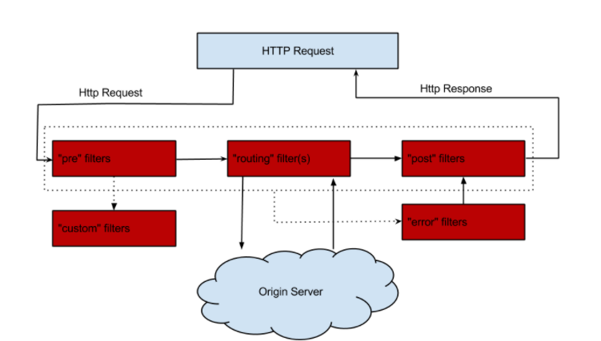

#ZUUL
`serviceId`的映射方式，除了对Zuul维护上更加友好之外，serviceId映射方式还支持了断路器，对于服务故障的情况下，可以有效的防止故障蔓延到服务网关上而影响整个系统的对外服务
##Zuul Filter
**filterType:** 返回一个字符串代表过滤器的类型，在zuul中定义了四种不同生命周期的过滤器类型，具体如下：
 - pre：可以在请求被路由之前调用
 - routing：在路由请求时候被调用
 - post：在routing和error过滤器之后被调用
 - error：处理请求时发生错误时被调用

##服务网关是微服务架构的重要部分
- 不仅仅实现了路由功能来屏蔽诸多服务细节，更实现了服务级别、均衡负载的路由。
- 实现了接口权限校验与微服务业务逻辑的解耦。通过服务网关中的过滤器，在各生命周期中去校验请求的内容，将原本在对外服务层做的校验前移，保证了微服务的无状态性，同时降低了微服务的测试难度，让服务本身更集中关注业务逻辑的处理。
- 实现了断路器，不会因为具体微服务的故障而导致服务网关的阻塞，依然可以对外服务。
